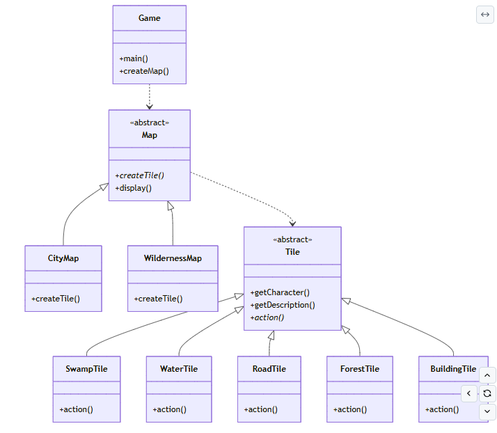

## Structure of Factory Method
### **1. Product**
Class Tile:(interface)
### **2 Concrete Products**: extends Product
extends Tile
  - SwampTile
  - WaterTile
  - BuildingTile
  - ForestTile
  - RoadTile
### **3. Creator**
Factory method is in this class
Class Map
### **4. Concrete Creators** : extends Creator  
extends Map 
- CityMap: **Concrete Creators**  
- WildernessMap: **Concrete Creators**
### **5. Client/Application/Driver class**
Class Game: use factory method and run programe.  
### **Notes**
The action() method in the concrete tile classes is not used in this assignment. It is there to illustrate that the concrete tile classes can have additional methods that are defined in the Tile interface.